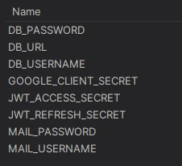

## 1. About the project

The 'AdBazaar' project is dedicated to developing an MVP for a mobile app marketplace. The entry point was high-level requirements that were crystallized by the team and transferred into epics, user stories, and tasks. The project has a duration of 4 months and follows the Scrum methodology.

The 'AdBazaar' platform is a self-contained mobile app serving as an online book marketplace where users can buy and sell products. It includes features like a search engine, sorting, user account management, favorites, pagination, book category filtering, and user profile management. While the primary focus is on paper books, the platform can be expanded to include other product categories in the future.

## 2. Front-end part of the project

Here is the front-end part of our project: <b><a href="https://github.com/toryrory/adbazaar-frontend">AdBazaar Client part</a></b>. 

## 3. How to start project locally

### 3.1 Prerequisites

* Java 17 or higher
* PostgreSQL 16

### 3.2 How to run

1. `Clone dev` branch.
2. Open with your preferable IDE(IDEA, VScode).
3. Open `Terminal` type `git checkout -b <branch_name>` or use git GUI plugins (this will create a new local branch).
4. Create database at your postgre server with name `adbazaar`.
5. `Add/Edit Configuration`:

    

6. Change `spring.profiles.active` to `default` from `dev_qa` in `application.yml`.
7. Add `Enviroment variables:`.
8. `Run Application`.
9. If you did everything correctly, you should be able to access swagger by this URL: <b><a href="http://localhost:8080/swagger-ui/index.html">Swagger API Docs</a></b>.
